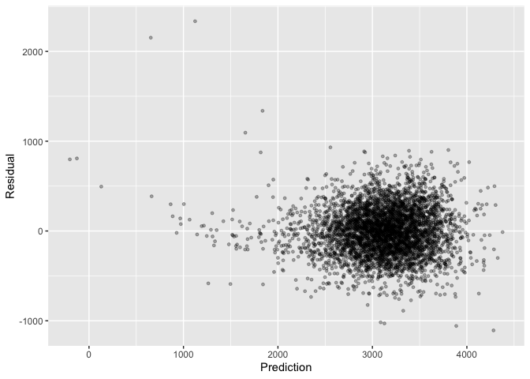

p8105\_hw6\_yg2834
================
Yucong Gao
11/28/2021

## Probelm 1

### Load and clean data

Handle factor variables

``` r
bwt = read.csv("./data/birthweight.csv")
bwt_df = 
  bwt %>%  
  mutate(babysex = ifelse(as.numeric(babysex) == 1, "male", "female"), 
         babysex = fct_relevel(babysex, c("male", "female")), 
         frace = case_when(as.numeric(frace) == 1 ~ "White", 
                           as.numeric(frace) == 2 ~ "Black",
                           as.numeric(frace) == 3 ~ "Asian",
                           as.numeric(frace) == 4 ~ "Puerto Rican",
                           as.numeric(frace) == 8 ~ "Other", 
                           TRUE ~ "Unknown"), 
         frace = fct_relevel(frace, c("White", "Black", "Asian", "Puerto Rican", "Other")), 
         mrace = case_when(as.numeric(mrace) == 1 ~ "White", 
                           as.numeric(mrace) == 2 ~ "Black",
                           as.numeric(mrace) == 3 ~ "Asian",
                           as.numeric(mrace) == 4 ~ "Puerto Rican",
                           as.numeric(mrace) == 8 ~ "Other", 
                           TRUE ~ "Unknown"), 
         mrace = fct_relevel(mrace, c("White", "Black", "Asian", "Puerto Rican")), 
         malform = ifelse(as.numeric(malform) == 1, "present", "absent"), 
         malform = fct_relevel(malform, c("absent", "present"))
         )
```

Check missing values

It is impossible for family monthly income and mother’s age at menarche
to be 0. Therefore, I consider them to be invalid value and decide to
drop these observations

``` r
bwt_df %>% 
  filter(bhead == 0 | blength == 0 | bwt == 0 | delwt == 0 | fincome == 0 | 
           gaweeks == 0 | menarche == 0 | mheight == 0 | momage == 0 | ppbmi == 0 | 
           ppwt == 0 )
```

    ##   babysex bhead blength  bwt delwt fincome frace gaweeks malform menarche
    ## 1  female    33      49 2495   163       0 White    36.7  absent       12
    ## 2  female    33      46 2466   138      25 Black    34.6  absent        0
    ##   mheight momage mrace parity pnumlbw pnumsga    ppbmi ppwt smoken wtgain
    ## 1      64     19 White      0       0       0 24.08119  140     20     23
    ## 2      68     13 Black      0       0       0 18.13172  119      0     19

``` r
bwt_df = 
  bwt_df %>% 
  filter(fincome != 0, 
         menarche != 0)
```

### Select variables for regression

For variables of pnumlbw and pnumgsa, there is only one level, 0 for
observation values, and for variable of parity, there were only three
non-observations, it is not meaningful to include these variables into
the regression model.

``` r
bwt_df %>% 
  filter(pnumlbw != 0)
```

    ##  [1] babysex  bhead    blength  bwt      delwt    fincome  frace    gaweeks 
    ##  [9] malform  menarche mheight  momage   mrace    parity   pnumlbw  pnumsga 
    ## [17] ppbmi    ppwt     smoken   wtgain  
    ## <0 rows> (or 0-length row.names)

``` r
bwt_df %>% 
  filter(pnumsga != 0)
```

    ##  [1] babysex  bhead    blength  bwt      delwt    fincome  frace    gaweeks 
    ##  [9] malform  menarche mheight  momage   mrace    parity   pnumlbw  pnumsga 
    ## [17] ppbmi    ppwt     smoken   wtgain  
    ## <0 rows> (or 0-length row.names)

``` r
bwt_df %>% 
  filter(parity != 0)
```

    ##   babysex bhead blength  bwt delwt fincome frace gaweeks malform menarche
    ## 1  female    34      51 3629   177      35 White    39.9  absent       13
    ## 2  female    34      47 3203   146       5 Black    41.7  absent       15
    ## 3  female    31      43 2523   122       5 Black    20.1  absent       14
    ##   mheight momage mrace parity pnumlbw pnumsga    ppbmi ppwt smoken wtgain
    ## 1      63     36 White      3       0       0 26.27184  148      0     29
    ## 2      64     23 Black      1       0       0 21.67307  126      5     20
    ## 3      61     27 Black      6       0       0 17.79828   94      3     28

Visualize the relationships between birth weight and some categorical
variables

the birth weight distributions are different across sex, race and
malform subgroups, and as father’s race are highly correlated with
mother’s race, so I decide to keep categorical variables of sex,
mother’s race and malform.

``` r
bwt_df %>% 
  ggplot(aes(x = babysex, y = bwt)) +
  geom_boxplot()
```

<!-- -->

``` r
bwt_df %>% 
  mutate(frace = fct_reorder(frace, bwt)) %>% 
  ggplot(aes(x = frace, y = bwt)) +
  geom_boxplot()
```

<!-- -->

``` r
bwt_df %>% 
  mutate(mrace = fct_reorder(mrace, bwt)) %>% 
  ggplot(aes(x = mrace, y = bwt)) +
  geom_boxplot()
```

<!-- -->

``` r
bwt_df  %>% 
  ggplot(aes(x = malform, y = bwt)) +
  geom_boxplot()
```

<!-- -->

Visualize the correlation between birth weight and some continuous
variables

``` r
cor_df = 
  bwt_df %>% 
  select(bhead, blength, delwt, fincome, gaweeks, 
         menarche, mheight, momage, ppbmi, ppwt, smoken, wtgain, bwt) %>% 
  relocate(bwt)

ggpairs(cor_df, lower = list(continuous = wrap("points", size = 0.01)), 
        upper = list(continuous = wrap("cor", size = 2.5))) + 
  theme(axis.text.x = element_text(size = 6, angle = 45),
          axis.text.y = element_text(size = 6, angle = 45))
```

<!-- -->

According to this correlation matrix, ppbmi and ppwt are highly
correlated with correlation coefficient equals 0.853. Ppwt and deliverwt
are also highly correlated with correlation coefficient equals 0.871.
Since all the above variables indicate weight of the mothers, I choose
to keep **ppbmi** and **wtgain** in the model

In addition, baby’s head circumference, baby’s length at birth, family
monthly income, gestational age in weeks, mother’s height and mom’s age
may positively influence baby’s birth weight. For that babies with
bigger head circumference and bigger length are likely heavier. Higher
family income is associated with better nutrition for mother, which can
result in bigger baby. Longer gestational age and younger mom are also
associated with healthier baby. On the other hand, smoking during
pregnancy may harm baby’s health, thus result in lower weight.

Therefore, for the regression model, sex, mrace, malform, ppbmi, wtgain,
bhead, blength, fincome, gaweeks, mheight, momage and smoken are
included

### Regression model

``` r
  lm(bwt ~ babysex + mrace + malform + ppbmi + wtgain + bhead + blength + fincome + gaweeks + mheight + momage + smoken, data = bwt_df) %>% 
  broom::tidy()
```

    ## # A tibble: 15 × 5
    ##    term               estimate std.error statistic   p.value
    ##    <chr>                 <dbl>     <dbl>     <dbl>     <dbl>
    ##  1 (Intercept)       -6452.      137.      -47.1   0        
    ##  2 babysexfemale        29.7       8.46      3.50  4.63e-  4
    ##  3 mraceBlack         -138.       10.2     -13.5   7.55e- 41
    ##  4 mraceAsian          -77.0      42.7      -1.80  7.15e-  2
    ##  5 mracePuerto Rican  -101.       19.4      -5.20  2.12e-  7
    ##  6 malformpresent        9.97     70.6       0.141 8.88e-  1
    ##  7 ppbmi                 8.18      1.35      6.07  1.36e-  9
    ##  8 wtgain                4.15      0.394    10.5   1.33e- 25
    ##  9 bhead               131.        3.45     38.0   2.72e-272
    ## 10 blength              74.9       2.02     37.0   3.62e-261
    ## 11 fincome               0.276     0.179     1.54  1.23e-  1
    ## 12 gaweeks              11.2       1.46      7.69  1.85e- 14
    ## 13 mheight              12.2       1.65      7.37  1.98e- 13
    ## 14 momage                0.651     1.20      0.545 5.86e-  1
    ## 15 smoken               -4.82      0.586    -8.22  2.65e- 16

From this model, we can conclude that presence malformation, family
income and mother’s age do not have significance on baby’s weight, so i
decide to drop these three variables and fit the model again

``` r
bwt_to_fit = bwt_df %>% select(bwt, babysex, mrace, ppbmi, wtgain, bhead, blength, gaweeks, mheight, smoken)
bwt_model = lm(bwt ~ babysex + mrace + ppbmi + wtgain + bhead + blength  + gaweeks + mheight + smoken, data = bwt_to_fit)

bwt_model %>% broom::tidy()
```

    ## # A tibble: 12 × 5
    ##    term              estimate std.error statistic   p.value
    ##    <chr>                <dbl>     <dbl>     <dbl>     <dbl>
    ##  1 (Intercept)       -6450.     136.       -47.3  0        
    ##  2 babysexfemale        29.3      8.46       3.47 5.29e-  4
    ##  3 mraceBlack         -146.       9.23     -15.8  1.59e- 54
    ##  4 mraceAsian          -76.9     42.3       -1.82 6.93e-  2
    ##  5 mracePuerto Rican  -106.      19.1       -5.56 2.89e-  8
    ##  6 ppbmi                 8.29     1.34       6.19 6.41e- 10
    ##  7 wtgain                4.11     0.392     10.5  2.08e- 25
    ##  8 bhead               131.       3.45      38.1  1.21e-273
    ##  9 blength              74.7      2.02      37.0  1.08e-260
    ## 10 gaweeks              11.3      1.46       7.78 8.75e- 15
    ## 11 mheight              12.5      1.64       7.63 2.80e- 14
    ## 12 smoken               -4.85     0.586     -8.27 1.75e- 16

### Residuals

``` r
bwt_to_fit = 
  bwt_to_fit %>% 
  modelr::add_predictions(bwt_model) %>% 
  modelr::add_residuals(bwt_model) 


bwt_to_fit %>% 
  ggplot(aes(x = pred, y = resid)) + 
  geom_point(alpha = .3, size = 1) + 
  labs(x = "Prediction", 
       y = "Residual")
```

<!-- -->

### Model Comparison

``` r
m1_df = bwt_df %>% select(bwt, blength, gaweeks)
m1_cv_df = crossv_mc(m1_df, 100)
m1_cv_df = 
  m1_cv_df %>% 
  mutate(train = map(train, as.tibble), 
         test = map(test, as.tibble)) %>% 
  mutate(model = map(train, ~ lm(bwt ~ blength + gaweeks, data = .x))) %>% 
  mutate(rmse = map2_dbl(model, test, ~rmse(model = .x, data = .y)), 
         which = "model1")
```

    ## Warning: `as.tibble()` was deprecated in tibble 2.0.0.
    ## Please use `as_tibble()` instead.
    ## The signature and semantics have changed, see `?as_tibble`.
    ## This warning is displayed once every 8 hours.
    ## Call `lifecycle::last_warnings()` to see where this warning was generated.

``` r
m2_df = bwt_df %>% select(bwt, bhead, blength, babysex)
m2_cv_df = crossv_mc(m2_df, 100)
m2_cv_df = 
  m2_cv_df %>% 
  mutate(train = map(train, as.tibble), 
         test = map(test, as.tibble)) %>% 
  mutate(model = map(train, ~lm(bwt ~ bhead + blength + babysex + bhead * blength + bhead * babysex + blength * babysex, data = .x))) %>% 
  mutate(rmse = map2_dbl(model, test, ~rmse(model = .x, data = .y)), 
         which = "model2")

m3_df = bwt_to_fit
m3_cv_df = crossv_mc(m3_df, 100)
m3_cv_df = 
  m3_cv_df %>% 
  mutate(train = map(train, as.tibble), 
         test = map(test, as.tibble)) %>% 
  mutate(model = map(train, ~lm(bwt ~ babysex + mrace + ppbmi + wtgain + bhead + blength  + gaweeks + mheight + smoken, data = .x))) %>% 
  mutate(rmse = map2_dbl(model, test, ~rmse(model = .x, data = .y)), 
         which = "model3")

bind_rows(m1_cv_df, m2_cv_df, m3_cv_df) %>% 
  ggplot(aes(x = which, y = rmse)) + 
  geom_boxplot() + 
  labs(x = "Model") + 
  scale_x_discrete(labels = c("Main Effects", "Interactions", "My Model"))
```

<!-- -->

## Problem 2

load data

``` r
weather_df = 
  rnoaa::meteo_pull_monitors(
    c("USW00094728"),
    var = c("PRCP", "TMIN", "TMAX"), 
    date_min = "2017-01-01",
    date_max = "2017-12-31") %>%
  mutate(
    name = recode(id, USW00094728 = "CentralPark_NY"),
    tmin = tmin / 10,
    tmax = tmax / 10) %>%
  select(name, id, everything())
```

    ## Registered S3 method overwritten by 'hoardr':
    ##   method           from
    ##   print.cache_info httr

    ## using cached file: ~/Library/Caches/R/noaa_ghcnd/USW00094728.dly

    ## date created (size, mb): 2021-09-09 10:53:28 (7.599)

    ## file min/max dates: 1869-01-01 / 2021-09-30

bootstrap

``` r
weather_strap_df = 
  weather_df %>% 
  bootstrap(n = 5000, id = "strap_number") %>% 
  mutate(models = map(strap, ~lm(tmax ~ tmin, data = .x)), 
         results = map(models, broom::tidy))
```

Adjusted R squared

``` r
adj_r2_df = 
  weather_strap_df %>% 
  select(strap_number, models) %>% 
  mutate(res_summary = map(models, broom::glance)) %>% 
  select(strap_number, res_summary) %>% 
  unnest(res_summary) %>% 
  select(strap_number, adj.r.squared)

adj_r2_df %>% 
  ggplot(aes(x = adj.r.squared)) + 
  geom_density()
```

<!-- -->

``` r
quantile(adj_r2_df %>% pull(adj.r.squared), prob = c(0.025, 0.975))
```

    ##      2.5%     97.5% 
    ## 0.8925815 0.9270560

After using bootstraping, the adjusted R-squared values are normally
distributed with a mean around 0.91. And a 95% confidence interval for
adjusted R-square is (0.893, 0.927)

log(beta0\_hat \* beta1\_hat)

``` r
log_df = 
  weather_strap_df %>% 
  select(strap_number, results) %>% 
  unnest(results) %>% 
  select(strap_number, term, estimate) %>% 
  pivot_wider(names_from = term, 
              values_from = estimate) %>% 
  janitor::clean_names() %>% 
  mutate(log = log(intercept * tmin))

log_df %>% 
  ggplot(aes(x = log)) + 
  geom_density() +
  labs(x = "log(beta0_hat * beta1_hat)")
```

<!-- -->

``` r
quantile(log_df %>% pull(log), prob = c(0.025, 0.975))
```

    ##     2.5%    97.5% 
    ## 1.965478 2.058125

After using bootstraping, values of log(beta0\_hat \* beta1\_hat) are
normally distributed with a mean around 2.02. And its 95% confidence
interval is (1.966, 2.06)
